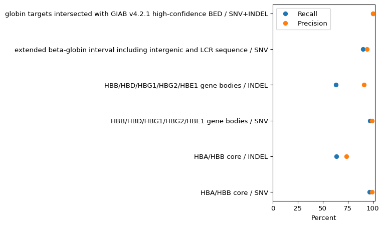

# NanoGlobin


NanoGlobin models an ONT amplicon assay as the PCR products generated by
a pair of chromosome haplotypes. It does not infer HBA copy state from a
fixed support threshold, treat amplicon abundance as genomic depth, or
promote agreement with another caller to ground truth.

``` text
assay profile + chromosome-haplotype sequences
    -> in-silico PCR and assay observability
FASTQ
    -> primer-aware molecule admission
    -> product and sequence evidence
    -> Cython chromosome-haplotype posterior
    -> resolved / assay-equivalent / posterior-ambiguous / no-call
```

The older Clair3, `bcftools csq`, CIGAR-deletion, Sniffles, cuteSV and
coverage paths remain evidence producers and comparators. They do not
independently define the final chromosome-haplotype state.

## Reproduce the repository review

``` bash
make review
```

`make review` builds the required Cython extension and renders this
document. The render itself runs the complete test suite and the
committed-evaluation checker; a failed test, inconsistent result record
or stale generated `README.md` fails CI.

``` python
import re
import subprocess


def run(command):
    result = subprocess.run(command, text=True, capture_output=True)
    if result.returncode:
        raise RuntimeError(result.stdout + result.stderr)
    return result.stdout.strip()

pytest_output = run(["python", "-m", "pytest"])
match = re.search(r"(\d+) passed", pytest_output)
if not match:
    raise RuntimeError("pytest passed count was not found")
print(f"{match.group(1)} tests passed")
print(run(["python", "scripts/check_evaluation.py"]))
```

    53 tests passed
    evaluation snapshots: OK
      small-variant evaluations: 6
      samples represented: 6
      structural comparator rows: 6
      public amplicon runs: 64
      Cython median speedup gate: 137.66x

## Committed small-variant evaluation

The following table is generated from
`evaluation/small_variant_results.tsv`. Five rows are the original
hap.py pool of HG002 plus five HPRC diploid-assembly genomes. The
separate HG002 row records a regional GIAB `bcftools norm`/`isec` check.
The large source VCFs and per-sample hap.py outputs are external to the
repository, so this checkout verifies the committed counts, metrics,
scope and provenance but does not recreate hap.py without those inputs.

``` python
import pandas as pd

small = pd.read_csv("evaluation/small_variant_results.tsv", sep="\t")
shown = small[[
    "region", "variant_type", "tp", "fn", "fp", "recall", "precision",
]].copy()
shown["recall"] = (100 * shown["recall"]).round(1)
shown["precision"] = (100 * shown["precision"]).round(1)
shown.columns = ["Region", "Type", "TP", "FN", "FP", "Recall (%)", "Precision (%)"]
print(shown.to_markdown(index=False))
```

| Region | Type | TP | FN | FP | Recall (%) | Precision (%) |
|:---|:---|---:|---:|---:|---:|---:|
| HBA/HBB core | SNV | 140 | 5 | 1 | 96.6 | 99.3 |
| HBA/HBB core | INDEL | 14 | 8 | 5 | 63.6 | 73.7 |
| HBB/HBD/HBG1/HBG2/HBE1 gene bodies | SNV | 156 | 5 | 1 | 96.9 | 99.4 |
| HBB/HBD/HBG1/HBG2/HBE1 gene bodies | INDEL | 31 | 18 | 3 | 63.3 | 91.2 |
| extended beta-globin interval including intergenic and LCR sequence | SNV | 788 | 84 | 49 | 90.4 | 94.1 |
| globin targets intersected with GIAB v4.2.1 high-confidence BED | SNV+INDEL | 23 | 0 | 0 | 100 | 100 |

``` python
import matplotlib.pyplot as plt

plot_data = small.copy()
plot_data["label"] = plot_data["region"] + " / " + plot_data["variant_type"]
long = plot_data.melt(
    id_vars="label",
    value_vars=["recall", "precision"],
    var_name="metric",
    value_name="value",
)
fig, ax = plt.subplots(figsize=(8, 4.8))
for metric, group in long.groupby("metric", sort=False):
    ax.plot(100 * group["value"], group["label"], "o", label=metric.title())
ax.set_xlabel("Percent")
ax.set_ylabel("")
ax.set_xlim(0, 102)
ax.legend()
fig.tight_layout()
plt.show()
```

<div id="fig-small-variant-results">



Figure 1: Recall and precision calculated from the committed HPRC/GIAB
counts.

</div>

The strongest recorded result is beta-globin gene-body SNV performance:
156 TP, 5 FN and 1 FP. Indels are the clear limitation. The 100% HG002
row contains only 23 regional small variants and is not whole-locus,
structural, or amplicon accuracy.

## HBA structural checks are comparator-only

`evaluation/hba_structural_comparators.tsv` records CIGAR-deletion
observations for samples selected or labelled by DRAGEN. The evaluation
checker requires every row to retain `truth_role=comparator_only`.

``` python
structural = pd.read_csv(
    "evaluation/hba_structural_comparators.tsv",
    sep="\t",
    keep_default_na=False,
)
print(structural[[
    "sample_id",
    "comparator_label",
    "observed_cigar_event_bp",
    "deletion_read_fraction",
    "interpretation",
]].to_markdown(index=False))
```

| sample_id | comparator_label | observed_cigar_event_bp | deletion_read_fraction | interpretation |
|:---|:---|---:|---:|:---|
| NA21106 | -alpha4.2/alphaalpha | 4257 | 0.58 | heterozygous-sized event |
| HG00642 | -alpha3.7/alphaalpha | 3804 | 0.71 | heterozygous-sized event |
| HG03136 | -alpha3.7/-alpha3.7 | 3804 | 1 | homozygous-sized event |
| HG00735 | alphaalphaalpha3.7/alphaalpha |  |  | no confident CIGAR deletion |
| HG03862 | –/alphaalpha | 10553 |  | large deletion candidate; zygosity unresolved |
| normal_controls_aggregate | four DRAGEN-labelled alphaalpha/alphaalpha controls |  |  | no confident CIGAR deletion |

A gain comparator with no deletion CIGAR can be excluded as a deletion
call, but that does not establish the exact gain structure.
Size-compatible `-alpha3.7` or `-alpha4.2` events require junction
sequence or event-appropriate orthogonal adjudication before they become
truth labels. Fraction-based zygosity is a research heuristic and is
especially weak when few molecules span a large event.

## The Cython scorer replaced the scalar implementation after measurement

The former scalar scorer was removed only after a frozen GitHub Actions
workload showed numerical parity for every likelihood component and
posterior and a material speed improvement. The raw replacement gate is
committed in `benchmarks/cython_genotype_proof.json`.

``` python
import json

with open("benchmarks/cython_genotype_proof.json", encoding="utf-8") as handle:
    proof = json.load(handle)
proof_table = pd.DataFrame([{
    "Candidate haplotypes": proof["workload"]["candidate_haplotypes"],
    "Observable classes": proof["workload"]["observable_genotype_classes"],
    "Molecule rows": proof["workload"]["molecule_rows"],
    "Scalar median (s)": proof["historical_python_seconds"]["median"],
    "Cython median (s)": proof["cython_seconds"]["median"],
    "Median speedup": proof["median_speedup"],
}])
print(proof_table.to_markdown(index=False, floatfmt=".6g"))
```

| Candidate haplotypes | Observable classes | Molecule rows | Scalar median (s) | Cython median (s) | Median speedup |
|---:|---:|---:|---:|---:|---:|
| 24 | 300 | 12000 | 8.01349 | 0.0582103 | 137.664 |

This is a genotype-kernel benchmark, not an end-to-end FASTQ runtime
claim.

## Published assay contract and public amplicon reads

The Huang et al. 2023 primer table is stored as an executable assay
profile. It is not an inferred or unpublished AmplideX design.

``` python
from nanoglobin.assay import load_assay_profile

profile = load_assay_profile("assays/huang_2023_ont_long_pcr.yml")
assay_table = pd.DataFrame([{
    "product": product.product_id,
    "forward": product.forward_primer,
    "reverse": product.reverse_primer,
    "minimum bp": product.min_length,
    "maximum bp": product.max_length,
} for product in profile.products])
print(assay_table.to_markdown(index=False))
```

| product | forward | reverse | minimum bp | maximum bp |
|:---|:---|:---|---:|---:|
| HBA_whole_and_rearranged | HBA_F | HBA_R | 3000 | 14000 |
| HBB_HBD_whole | HBD_F | HBB_R | 8000 | 13000 |
| HBG_whole | HBG_F | HBG_R | 7000 | 13000 |
| SEA_deletion | SEA_F | SEA_R | 3000 | 14000 |
| THAI_FIL_deletion | TF_F | TF_R | 3000 | 14000 |
| alpha_27_6_deletion | TF_F | HBA_R | 3000 | 14000 |
| SEA_HPFH_deletion | HBD_F | SH_R | 3000 | 14000 |
| Chinese_Ggamma_Agammadeltabeta0_deletion | HBG_F | DB_R | 3000 | 14000 |

`evaluation/public_amplicon_runs.tsv` contains 64 public GridION run
accessions. Those reads can support endpoint reconstruction,
product-length, imbalance, artifact, memory and runtime analyses. No
independent sample-level genotype table is committed for those runs, so
they cannot support genotype sensitivity or specificity.

``` python
public_runs = pd.read_csv("evaluation/public_amplicon_runs.tsv", sep="\t")
print(
    f"{public_runs['run_accession'].nunique()} unique public runs; "
    f"instrument(s): {', '.join(sorted(public_runs['instrument_model'].unique()))}"
)
```

    64 unique public runs; instrument(s): GridION

## Thesis role and evidence boundary

The initial thesis is a retrospective Dubai Genetics Center study with
five aims: reported HBA/HBB landscape, HBA modification of
HBB-associated phenotypes, public-database representation,
characterization of an ONT-tested cohort, and an ascertainment-aware
comparison of conventional and ONT reporting eras. NanoGlobin is its
methods arm, not a replacement for the cohort analysis.

Patient-level cohort data are not committed. The historical and ONT
tables are separate referral cohorts with selective clinical reporting;
their distributions are reported diagnostic spectra, not same-patient
platform concordance or population prevalence.

The repository currently does **not** establish:

- analytical accuracy for the exact AmplideX assay;
- HBA gain structure from coverage or reciprocal interval overlap alone;
- multiplex-PCR efficiency or dropout from HPRC/GIAB WGS data;
- independent truth from DRAGEN or vendor output; or
- clinical deployment performance.

## Evidence-bearing files

- `evaluation/small_variant_results.tsv`: counts, truth source and
  comparison scope.
- `evaluation/happy_summary_final.txt`: retained pooled hap.py summary
  snapshot.
- `evaluation/hba_structural_comparators.tsv`: comparator-only HBA
  observations.
- `evaluation/public_amplicon_runs.tsv`: public run accessions without
  genotype truth.
- `benchmarks/cython_genotype_proof.json`: measured Cython replacement
  gate.
- `run_happy.sh`, `giab_HG002.sh`, `run_pipeline_hprc.sh`: external-data
  commands.
- `scripts/check_evaluation.py`: arithmetic and provenance-role checks.
- `thesis/`: Quarto/Typst manuscript source using real committed
  evaluation tables.

Do not add a design document before the corresponding code, test, result
record and provenance exist. Method explanations belong here or in the
manuscript source.
